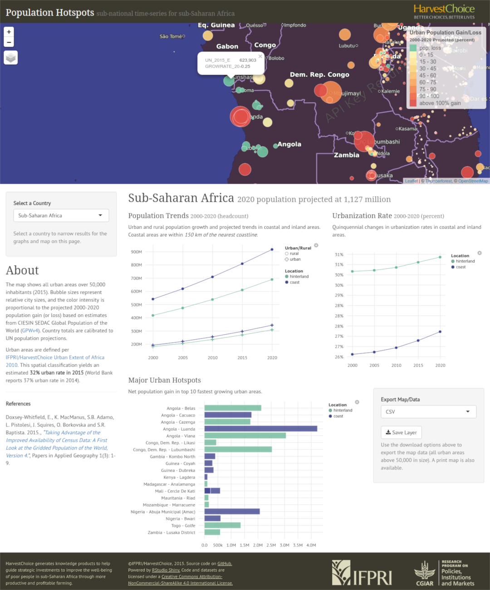
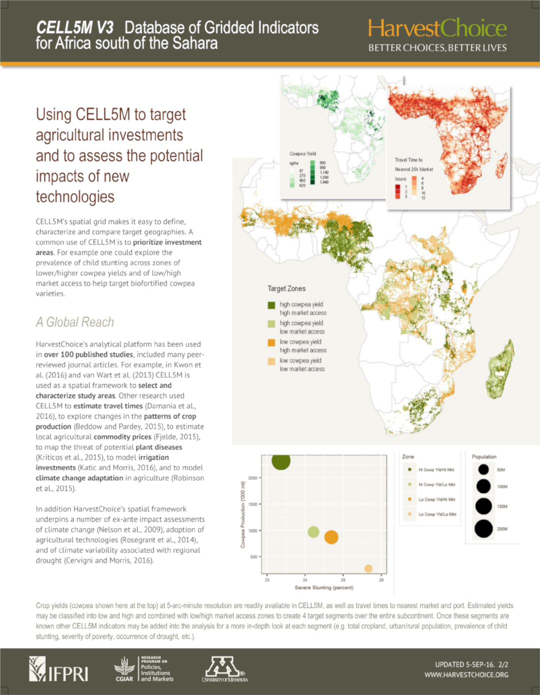

```{r setup, include=FALSE}

library(flexdashboard)
library(knitr)
library(htmltools)

```

# R/Shiny Applications {.storyboard}

### <big>Long-Term Climatic Trends</big> for sub-Saharan Africa

```{r}

include_graphics("../assets/mbacou-shiny-climate.png")

```

***

Long-term Climatic Trends

http://tools.harvestchoice.org/rainfall

This interactive tool renders long-term monthly precipitation, near-surface temperature, and Palmer Drought Severity Index time series for sub-Saharan Africa. Gridded estimates are summarized across districts (level-2 administrative units) based on FAO GAUL 2008 boundaries for the period of 1960-2013. District-level means, seasonality-adjusted means (trend), and standard deviations are provided. All data may be downloaded in CSV or STATA formats. The 1960-2013 spatial rasters for each country may also be saved to GeoTIFF, ASCII Raster, and netCDF formats for use in a desktop GIS.

<u>How to cite</u>  
HarvestChoice, 2014. *"Long-Term Climate Trends for sub-Saharan Africa."* International Food Policy Research Institute, Washington, DC., and University of Minnesota, St. Paul, MN. Available online at http://harvestchoice.org/node/9711.

<u>Tools</u>  
R, ggvis, leaflet, hansontable JS

### <big>Sub-national Poverty and Inequalities Trends</big> for sub-Saharan Africa

```{r}

include_graphics("../assets/mbacou-shiny-poverty.png")

```

***

Sub-national Poverty and Inequalities Trends

http://tools.harvestchoice.org/subnatpov

An R/Shiny interactive visual that provides circa-2005 sub-national expenditure, poverty and inequality estimates across 60 countries in Africa South of the Sahara. Estimates are further broken out across gender and urban/rural residences.

<u>How to cite</u>  
HarvestChoice, 2015. *"Poverty Headcount Ratio at below PPP $1.25/day and $2/day, circa 2008 (vector format, r.1.1)."* International Food Policy Research Institute, Washington, DC., and University of Minnesota, St. Paul, MN. On-line at http://tools.harvestchoice.org/subnatpov.

<u>Tools</u>  
R, ggvis, leaflet, hansontable JS


### <big>Coastal and Hinterland Population Hotspots</big> in sub-Saharan Africa

```{r}



```

***

Population Hotspots in Africa South of the Sahara

http://tools.harvestchoice.org/popTrends

Interactive map and graphs showing Africa's urban areas over 50,000 inhabitants (2015). Bubble sizes represent relative city sizes, and the color intensity is proportional to the projected 2000-2020 population gain (or loss) based on estimates from CIESIN SEDAC Global Population of the World (GPWv4). Country totals are calibrated to UN population projections. This tool explores the differential urban growth rates between coastal and hinterland areas.

<u>How to cite</u>  
HarvestChoice, 2016. *"Coastal and Hinterland Population Hostspots in Africa South of the Sahara 2000-2020"* International Food Policy Research Institute, Washington, DC., and University of Minnesota, St. Paul, MN. On-line at http://tools.harvestchoice.org/popTrends.

<u>Tools</u>  
R, ggvis, leaflet


### <big>Comparing Travel Times</big> across sub-Saharan Africa

```{r}

include_graphics("../assets/mbacou-shiny-traveltimes.png")

```

***

Comparing Travel Times Tools, sub-Saharan Africa

http://tools.harvestchoice.org/traveltime/

This tool provides simplified access to Google, HERE and OSRM (OpenStreetMap) distance and routing APIs to return and compare travel time estimates over sub-Saharan Africa.

<u>How to cite</u>  
HarvestChoice, 2016. *"Comparison of Travel Time Estimates across Africa South of the Sahara 2000-2020"* International Food Policy Research Institute, Washington, DC., and University of Minnesota, St. Paul, MN. On-line at http://tools.harvestchoice.org/traveltime.

<u>Tools</u>  
R, ggvis, leaflet

# Tableau&reg; Dashboards {.storyboard}

### <big>Regional Agricultural Snapshots</big> for Africa

```{r}

include_graphics("../assets/mbacou-tableau-crdash.png")

```

***

IFPRI/HarvestChoice Regional Agricultural Snapshots

https://public.tableau.com/profile/mel.b.#!/vizhome/crDash/Overview 

Report the status of agricultural macro indicators across Africa's geographic regions and economic zones.

<u>Tools</u>  
Tableau&reg;, R

### <big>Standardized Farm Characteristics</big>, Ghana 2005

```{r}


```

***

Standardized Farm Characteristics, Ghana 2005

https://public.tableau.com/profile/mel.b.#!/vizhome/GHA-GLSS5/Overview

A collection of farm and household characteristics extracted from the 2005 Ghana Living Standard  Survey (GLSS-5).

<u>Tools</u>  
Tableau&reg;, R

### <big>Country Agricultural Dashboards</big> for Africa

```{r}


```

*** 

IFPRI/HarvestChoice Country Agricultutal Dashboards

https://public.tableau.com/profile/mel.b.#!/vizhome/HCIICharts/CountryDashboard

IFPRI/HarvestChoice country dashboards provide a one-page view of national time-series and sub-national statistics for 52 countries in sub-Saharan Africa.Statistics are aggregated across geographic domains, including administrative units, agro-ecological zones, farming systems, time-to-market zones, and low to high population density areas.

<u>Tools</u>  
Tableau&reg;, R


# Print Production {.storyboard}

### <big>HarvestChoice Gridded Database of Indicators</big> for Africa South of the Sahara (recto-verso flyer)

```{r}



```

***

HarvestChoice Gridded Database of Indicators for Africa South of the Sahara

US-letter flyer provides an overview of a large collection of spatially explicit indicators.

<u>Tools</u>  
R, ggplo2, Adobe Illustrator, Inkscape

### <big>IFPRI Spatial Production Allocation Model</big> (recto-verso flyer)

```{r}


```

***

IFPRI Spatial Production Allocation Model (flyer)

US-letter flyer.

<u>Tools</u>  
Adobe Illustrator, Inkscape, PowerPoint


### <big>Agricultural & Nutrition Technology Ontology</big> (recto-verso flyer)

```{r}

include_graphics("../assets/mbacou-print-hcant.png")

```

***

Agricultural & Nutrition Technology Ontology

US-letter flyer.

<u>Tools</u>   
Adobe Illustrator, Inkscape, PowerPoint

### <big>IFPRI Open Data Show Case</big> (conference poster)

```{r}


```

***

IFPRI Open Data Show Case

Agricultural & Nutrition Technology Ontology

A3 poster.

<u>Tools</u>  
Adobe Illustrator, Inkscape, PowerPoint

### <big>IFPRI Spatial Production Allocation Model</big> (conference poster)

```{r}


```

***

IFPRI Spatial Production Allocation Model (poster)

A3 poster.

<u>Tools</u>  
Adobe Illustrator, Inkscape
